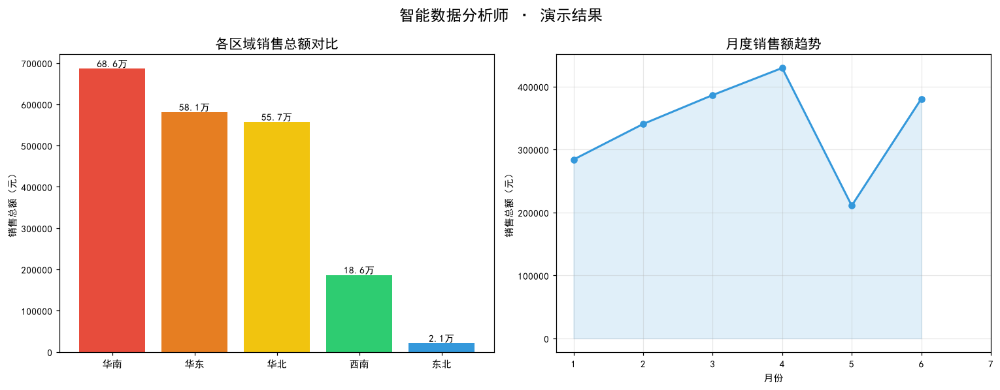

# 智能数据分析师（Data Analyst Agent）

> 基于 Hello-Agents 框架的自然语言驱动数据分析智能体——**你说需求，它出报告**。

## 项目信息

- **项目名称**：智能数据分析师（Agent Data Analyst）
- **作者**：BeiXiao-929
- **项目类型**：数据分析
- **开发框架**：[Hello-Agents](https://github.com/datawhalechina/hello-agents)

## 项目简介

用户只需用一句自然语言提出数据分析需求，Agent 即可自主完成 **数据加载 → 数据质量诊断 → 统计分析 → 数据清洗 → 可视化图表生成 → 业务洞察总结** 的完整分析流程，输出一份带数字支撑、带图表、带可执行建议的结构化分析报告，让零编程基础的业务人员也能一键获得专业数据分析。

## 核心功能

- [x] **自然语言交互**：无需 SQL / Python，一句话发起完整分析
- [x] **数据质量诊断**：自动识别缺失值、重复行并生成诊断报告
- [x] **智能数据清洗**：数值列中位数填充、类别列众数填充、自动去重
- [x] **统计分析**：数值列描述性统计 + 类别列分布分析，支持按列下钻
- [x] **自动可视化**：根据分析意图自动选择柱状图/折线图/饼图/直方图/散点图
- [x] **业务洞察报告**：按「数据概况 / 关键发现 / 图表 / 业务建议」结构化输出

## 技术亮点

- 基于 Hello-Agents 1.x 的 **ReAct 范式**（Reasoning-Acting-Observation 循环 / Function Calling）实现多工具自主规划调用
- 自定义 4 个数据分析工具（csv_loader / data_stats / data_cleaner / data_visualizer），遵循 1.x 新版 `Tool` + `ToolRegistry` + `ToolResponse` 协议，覆盖分析全流程
- **智能图表选型**：通过系统提示词将「对比→柱状图、趋势→折线图、占比→饼图、分布→直方图」的选型经验注入 Agent
- **工具层健壮性设计**：description 中内置参数格式示例，`run()` 内做路径清洗与容错解析，容忍 LLM 输出的格式抖动
- 附带 **8 项工具层自动化测试**，覆盖正常与异常输入

## 演示效果



> Agent 分析 `data/sample_sales.csv` 后自动生成的图表：各区域销售总额对比 + 月度销售额趋势。

## 环境要求

- Python 3.10+
- 配置大模型 API Key（支持智谱 / OpenAI / DashScope 等，参见 [Hello-Agents 文档](https://github.com/datawhalechina/hello-agents)）

## 快速开始

```bash
# 1. 克隆项目
git clone https://github.com/你的用户名/hello-agents.git
cd hello-agents/Co-creation-projects/DataAnalystAgent

# 2. 安装依赖（hello-agents >= 1.0.0，新版 API）
pip install -r requirements.txt

# 3. 配置 API Key（重要：1.x 读取 LLM_API_KEY，不是 ZHIPU_API_KEY）
echo "LLM_MODEL_ID=glm-4-flash" > api.env
echo "LLM_API_KEY=your_api_key_here" >> api.env
echo "LLM_BASE_URL=https://open.bigmodel.cn/api/paas/v4" >> api.env

# 4. 启动 Jupyter 运行 main.ipynb
jupyter lab main.ipynb
```

## 使用示例

```python
# 一句话发起完整分析
agent.run(
    "请对 data/sample_sales.csv 做一次完整的销售分析：先检查并清洗数据质量问题，"
    "然后对比各区域的销售表现，生成一张区域销售额柱状图，"
    "最后总结关键发现并给出下半年的业务建议。"
)
```

Agent 将自动依次调用 `csv_loader → data_cleaner → data_stats → data_visualizer`，并输出 Markdown 格式的分析报告。

## 项目结构

```
DataAnalystAgent/
├── README.md              # 项目说明
├── requirements.txt       # 依赖清单
├── main.ipynb             # 主程序（工具定义 + 智能体构建 + 演示 + 评估）
├── .gitignore
├── data/
│   ├── sample_sales.csv   # 示例数据（100条记录，<10KB）
│   └── gen_sample_data.py # 示例数据生成脚本（可复现）
└── outputs/
    └── demo_result.png    # 演示结果图（<1MB）
```

## 数据和资源

### 示例数据

项目内置小规模示例数据用于快速测试：`data/sample_sales.csv`（100 条电商订单记录，刻意注入了缺失值与重复行用于演示数据清洗功能）。运行 `python data/gen_sample_data.py` 可复现该数据集。

### 完整数据集

完整数据集（50万条订单记录，约 120MB）请从以下链接下载：

- 百度网盘：[链接] 提取码：xxxx
- 下载后解压到 `data/` 目录

### 演示视频

- B站：[项目演示视频](链接)
- YouTube：[Demo Video](链接)

## 自检清单

- [x] 代码能够正常运行
- [x] README 文档完整
- [x] requirements.txt 完整
- [x] 有清晰的使用示例
- [x] 代码有适当的注释
- [x] 项目总体积 < 5MB，无大文件提交

## License

MIT License
