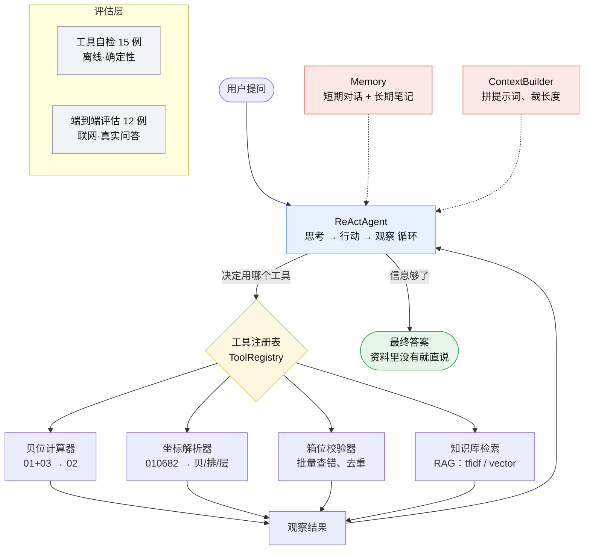

# StowageAgent - 集装箱船配载智能体

[](https://www.python.org/)
[](./LICENSE)
[](./outputs/评估报告.json)
[](./outputs/评估报告.json)
[](#-技术栈)

> 一个会查配载规则、会算贝位坐标的集装箱船配载助手。
> 纯 Python 手写 ReAct 循环，**不依赖任何 Agent 框架，装 4 个包就能跑。**

---

## 📝 项目简介

StowageAgent 是一个面向集装箱船配载场景的智能体。它要解决的是配载作业里最重复、最容易出错的两件事：

1. **查规则** —— 40 尺箱该写大贝号还是小贝号？层号 84 在甲板还是舱内？图上出现一个星号算不算箱位？
   这些规则散在经验里、散在旧文件里，每次都要翻。
2. **算坐标** —— 把贝位、排位、层号拼成六位坐标，还要校验有没有算错、有没有重复。
   纯手工做，眼睛累、容易错。

本项目把一个智能体接进这两件事，它能够：

- 规则问题 → **先查知识库再回答**（RAG），资料里没有就老实说没有，不瞎编。
- 计算问题 → **调用工具算**，不让大模型心算（它算数真的不行）。
- 算完 → **自动校验** 一批坐标，把错的地方挑出来。
- 全过程 → 把「思考 → 行动 → 观察」每一步打印出来，看得见它为什么这么答。

本项目为**纯 Python 实现**：命令行入口 `main.py` + 教学版 Notebook `main.ipynb`，没有前端页面，
也不依赖任何 Agent 框架 —— 只用 `openai` 一个 SDK 手写 ReAct 循环。

### 模块划分：7 个文件各管什么

| 模块 | 职责 |
|---|---|
| `src/llm.py` | 大模型接入 —— 怎么跟模型说话 |
| `src/tools.py` | 工具系统 —— 4 个真实业务工具 + 工具注册表 |
| `src/rag.py` | 知识库检索 —— 翻资料（tfidf / vector 双模式） |
| `src/memory.py` | 记忆 —— 短期对话 + 长期笔记 |
| `src/context.py` | 上下文工程 —— 拼提示词、裁长度 |
| `src/agent.py` | Agent 主体 —— 手写 ReAct 循环（思考 → 行动 → 观察） |
| `src/evaluate.py` | 性能评估 —— 给自己的 Agent 打分 |

> 本项目**故意不依赖任何 Agent 框架**，只用 `openai` 一个 SDK 手写，
> 方便你看清一个智能体内部到底在做什么：这 7 个文件读完，骨架就清楚了。

### 整体结构



### 适用场景

- **想学 Agent 开发但被框架绕晕的人** —— 这个项目的 ReAct 循环不依赖任何框架，`src/agent.py` 全部 208 行，能一行不跳地读完
- **想做「文档问答」类应用的人** —— RAG 的四步拆成了四个方法，一步一步看
- **集装箱配载 / 货运相关从业者** —— 知识库里的规则是真的，可以直接拿去用
- **想给 Agent 写测试的人** —— 项目里有两层评估：工具层单元测试 + 端到端准确率

---

## ✨ 核心功能

- [x] **贝位计算器**：小贝合成大贝（01+03→02），大贝拆小贝，非法配对会报错。
- [x] **坐标解析器**：六位坐标 ↔ 贝位 / 排位 / 层号互转，自动判断舱内还是甲板，强制补前导零。
- [x] **箱位校验器**：批量校验坐标 —— 格式错误、重复、40 尺箱写了奇数贝位，并统计各箱型数量。
- [x] **知识库检索（RAG）**：两种检索模式 `tfidf`（关键词）和 `vector`（语义向量），可对比效果。
- [x] **ReAct 循环**：自己决定该用哪个工具、该不该查资料，最多循环 5 轮。
- [x] **记忆机制**：短期对话记忆（`chat` 模式能记住前面说过的话）+ 长期笔记文件。
- [x] **两层评估**：工具层（离线、免费、结果确定）+ 端到端（联网、测真实问答能力）。
- [x] **不会瞎编**：资料里没有的问题，它会回答「没有提到」，项目里有专门的测试用例测这一点。

---

## 📁 项目结构

```
dandan693-StowageAgent/
├── main.py                  # 命令行入口：tools / ask / chat / eval
├── main.ipynb               # 教学版 Notebook：按步骤点下来就跑完
├── requirements.txt
├── .env.example             # 复制成 .env 再填密钥
├── LICENSE                  # MIT
├── src/                     # ← 核心代码
│   ├── llm.py               # 大模型接入：跟大模型说话
│   ├── tools.py             # 工具系统：4 个业务工具 + 工具注册表
│   ├── rag.py               # 知识库检索（tfidf / vector 双模式）
│   ├── memory.py            # 短期对话记忆 + 长期笔记
│   ├── context.py           # 拼提示词、裁上下文长度
│   ├── agent.py             # 手写 ReAct 循环
│   └── evaluate.py          # 两层评估
├── data/
│   ├── 配载知识库.txt        # 21 段真实配载规则（RAG 的「资料」）
│   └── 测试用例.json         # 15 条工具自检 + 12 条端到端用例
└── outputs/
    ├── 评估报告.json         # 评估结果（跟仓库一起提交，作为证据）
    └── 长期笔记.md           # Agent 运行中自己记的笔记
```

---

## 🛠️ 技术栈

- **智能体范式**：**手写 ReAct**，没有使用任何 Agent 框架
- **大模型调用**：`openai` SDK —— 任何兼容 OpenAI 接口的服务都能用（DeepSeek / 通义 / 智谱 / 本地 vLLM）
- **检索**：`scikit-learn` 的 TF-IDF（默认）；可选 `sentence-transformers` 做语义向量
- **记忆**：手写实现 —— 短期 messages 列表 + 长期 md 笔记文件
- **配置**：`python-dotenv` 读 `.env`
- **评估**：手写两层评估框架，结果落盘成 JSON

**为什么不直接用现成的 Agent 框架？**
先手写一遍，才知道框架替你干了什么。
项目里的模块划分（`llm` / `tools` / `memory` / `context` / `agent` / `evaluate`）和主流框架的设计是一一对应的。

---

## 🚀 快速开始

### 环境要求

- Python 3.10 或以上
- 一个兼容 OpenAI 接口的大模型 API Key（DeepSeek 有免费额度，注册很快）

### 1. 安装依赖

```bash
pip install -r requirements.txt
```

需要联网，会装 `openai` / `python-dotenv` / `scikit-learn` / `numpy` 四个包，一分钟以内。

### 2. 配置 API 密钥

```bash
# Windows
copy .env.example .env
# macOS / Linux
cp .env.example .env
```

然后打开 `.env`，填上你自己的信息：

```env
LLM_MODEL_ID=deepseek-chat
LLM_API_KEY=sk-你的密钥
LLM_BASE_URL=https://api.deepseek.com/v1
LLM_TIMEOUT=60
```

> ⚠️ `.env` 已经被 `.gitignore` 挡住了，不会上传到 GitHub。但你自己要记住：
> **API Key 提交上去，几小时内就会被爬虫扫到盗用。** 这是新手最常见的翻车点。

### 3. 运行项目

在**项目根目录**下执行：

```bash
# 3.1 看看有哪些工具
python main.py tools

# 3.2 问一个问题（--show-steps 会打印它的思考过程）
python main.py ask "贝位 09 和 11 合成的大贝是几号？" --show-steps

# 3.3 只用检索、不调用大模型 —— 想看懂 RAG 原理就跑这个，免费且秒出
python main.py ask "坐标的前导零丢了会怎样" --no-llm

# 3.4 连续对话（能记住前面说过的话）
python main.py chat

# 3.5 跑评估
python main.py eval --offline    # 工具自检，免费，秒出
python main.py eval --online     # 端到端评估，要调大模型，慢
python main.py eval --all        # 两层都跑
```

### 4. 或者用 Notebook 学

```bash
jupyter lab main.ipynb
```

`main.ipynb` 是**教学版**：每一步单独一格，从连大模型到跑评估，按顺序点下来就把 7 章串起来了。

### 💡 常见启动问题与注意事项

- **没有 API Key 想先看效果？** 加 `--no-llm` 参数，只用检索、不调用大模型，一分钱不花也能跑通。
- **提示 `ModuleNotFoundError: No module named 'src'`？** 请确认你在**项目根目录**（能看到 `main.py` 的那一层）执行命令。`main.py` 已经做了路径兜底，从项目根跑最稳。
- **在 Notebook 里改了 `.env` 不生效？** 环境变量在进程启动时读入，改完 `.env` 需要**重启内核**（或重新跑一遍加载单元格）。命令行则每次运行都会重新读，不受影响。
- **`pip` 报错（Fatal error in launcher / 找不到 pip）？** 改用 `python -m pip install -r requirements.txt`，这是最通用的写法。
- **想用语义向量检索？** 加 `--mode vector`，但需要先取消 `requirements.txt` 里 `sentence-transformers` 那行的注释，首次运行还会下载约 400MB 的中文向量模型。**建议先用默认的 `tfidf` 把流程跑通。**
- **中文输出乱码？** Windows 终端先切一下编码：PowerShell 执行 `$env:PYTHONIOENCODING="utf-8"`，CMD 执行 `chcp 65001`。
- **调用大模型报 401 / 连接超时？** 检查 `.env` 里 `LLM_BASE_URL` 结尾是否带 `/v1`（不同服务商要求不同），以及 `LLM_MODEL_ID` 是否服务商真实支持的模型名。

---

## 📖 使用示例

### 例 1：复合问题（既要用工具、又要查资料）

```bash
python main.py ask "贝位 09 和 11 合成的大贝是几号？层号 84 的箱子在甲板上还是船舱里？" --show-steps
```

实际运行过程（这就是 ReAct 的「思考轨迹」）：

```text
── 第 1 轮 ──
  💭 思考：用户问贝位 09 和 11 合成的大贝号，这需要贝位计算器；层号 84 属于舱内还是甲板需要查配载规则。
  🔧 行动：贝位计算器
  📥 输入：09+11
  👀 观察：09 + 11 → 大贝 10
说明：40尺箱写大贝号 10；20尺箱写各自的小贝号 09 / 11

── 第 2 轮 ──
  💭 思考：大贝已由贝位计算器返回为 10；层号 84 需要查配载规则确认。
  🔧 行动：知识库检索
  📥 输入：层号84是舱内还是甲板
  👀 观察：【资料1｜相关度 0.396】
层号决定箱子在船的什么位置：层号 02 到 08 表示箱子装在船舱内部（舱内）；层号 82 及以上（常见 82、84、86、88）表示箱子装在甲板上（舱面）……

── 第 3 轮 ──
  💭 思考：贝位 09 和 11 合成的大贝已由贝位计算器返回为 10；层号 84 根据资料1属于甲板（舱面）。
  ✅ 最终答案：贝位 09 和 11 合成的大贝是 10 号；层号 84 的箱子在甲板上（舱面）。
```

注意它做了两件普通聊天机器人做不到的事：
**自己选了正确的工具**，而且**数字是从工具拿的，不是自己算的**。

### 例 2：边界情况（测它会不会瞎编）

```bash
python main.py ask "宁波到洛杉矶一个 40 尺柜的运费是多少？"
```

预期回答会包含「没有提到」。这条在 `data/测试用例.json` 里是专门的测试用例，
因为**「不瞎编」是 RAG 最核心的价值，必须测**。

### 例 3：只用检索，看懂 RAG 原理

```bash
python main.py ask "坐标的前导零丢了会怎样" --no-llm
```

会把**实际发给大模型的完整提示词**打印出来。你会发现 RAG 说穿了就是
「自动帮你把资料粘到问题前面」—— 不神秘。

### 例 4：批量校验坐标

```python
from src import StowageCheckTool

print(StowageCheckTool().run("""
HE 010682
f 010304
NE 040406
NE 040406
"""))
```

输出会指出：`HE 010682` 的 40 尺箱写了奇数贝位、`NE 040406` 重复了。

---

## 🎯 项目亮点

- **模块职责清晰、一一对应**：`src/` 下 7 个模块各管一件事，上面有对照表，不用在几千行代码里找「那个功能在哪」。
- **完全手写 ReAct，没有框架黑盒**：`src/agent.py` 一共 208 行，其中真正驱动循环的不到 50 行，Thought / Action / Observation 全都打印出来给你看。
- **知识库是真实业务规则，不是「张三李四」的假数据**：`data/配载知识库.txt` 里 21 段规则全部来自真实的配载作业经验（贝位合成规则、不同图纸排版、不同船的占位符号差异、前导零的坑……），这也是它和网上那些 RAG demo 最大的区别。
- **两层评估，是「测试」而不是「感觉」**：工具层 15 个确定性断言 2 秒跑完，是最快的安全网；端到端 12 个用例里专门放了 2 个「不该瞎编」的边界用例。
- **零框架依赖，`pip install` 4 个包就能跑**：可复现性最好，不会因为某个框架升级就挂掉；想换成现成的 Agent 框架，改 `src/agent.py` 一个文件就行。

---

## 📊 性能评估

### 第一层：工具自检（离线，结果确定）

```bash
python main.py eval --offline
```

| 指标 | 结果 |
|---|---|
| 用例数 | 15 |
| 通过 | 15 |
| 通过率 | **100%** |

覆盖范围：贝位合成（含非法配对报错）、大贝拆小贝、坐标拆解、舱内 / 甲板判定、
前导零补位、六位码格式校验、40 尺箱贝位奇偶校验、重复坐标检测、知识库检索命中。

> 这一层**不调用大模型**，所以结果完全确定、可重复，适合放进 CI。

### 第二层：端到端评估（联网）

```bash
python main.py eval --online
```

| 指标 | 结果 |
|---|---|
| 用例数 | 12 |
| 通过 | 12 |
| 准确率 | **100%** |
| 平均耗时 | 12.5 秒 / 题 |

| 分类 | 用例数 | 准确率 |
|---|---|---|
| 规则问答 | 6 | 100% |
| 会用工具 | 4 | 100% |
| 边界情况（不该瞎编） | 2 | 100% |

**真实运行片段**（`python main.py ask "..." --show-steps`）：

```text
── 第 1 轮 ──
  💭 思考：用户问贝位 09 和 11 合成的大贝号，这需要贝位计算器；层号 84 需要查配载规则。
  🔧 行动：贝位计算器
  👀 观察：09 + 11 → 大贝 10
说明：40尺箱写大贝号 10；20尺箱写各自的小贝号 09 / 11

── 第 2 轮 ──
  🔧 行动：知识库检索
  👀 观察：【资料1｜相关度 0.396】
层号决定箱子在船的什么位置：层号 02 到 08 表示箱子装在船舱内部（舱内）；
层号 82 及以上（常见 82、84、86、88）表示箱子装在甲板上（舱面）……

── 第 3 轮 ──
  ✅ 最终答案：贝位 09 和 11 合成的大贝是 10 号；层号 84 的箱子在甲板上（舱面）。
```

**边界用例的表现**（这两条最能说明 RAG 的价值）：

| 问题 | 回答 |
|---|---|
| 宁波到洛杉矶一个 40 尺柜的运费是多少？ | 资料里没有提到。 |
| 今天舟山港的风速有几级？ | 资料里没有提到。 |

> 普通聊天机器人会一本正经地编一个数字出来。RAG 被「只准根据资料回答」这条提示词勒住，
> 宁可说不知道 —— 这也是抑制「模型幻觉」最有效的做法之一。

### ⚠️ 两次真实的「评估驱动改进」（这段比分数本身更重要）

**这两次都发生在同一天、同一个项目上。它们说明：跑评估最有价值的产出不是分数，而是「发现问题」。**

#### 第一次：产品真的错了 —— 91.7% → 100%

第一轮跑出来 **11/12**，挂掉的是这一题：

> 读 .xls 和 .xlsx 分别要用什么 Python 库？

答案在知识库里**明明有**，但 Agent 一步工具都没调（步数 = 0），直接说「资料里没有提到」。

- **排查**：不是知识库缺内容，也不是检索不准 —— 是**提示词纪律不够**。
  最初的提示词只写了「不要瞎编」，模型就理解成「不知道就可以直接说没有」，跳过了「先查再答」。
- **改法**（`src/agent.py` 的 system prompt）：

```text
3. 凡是涉及配载业务规则、图纸规则、文件读写约定这类问题，不管你自己觉不觉得知道答案，
   都必须先调用【知识库检索】把资料拿到手，再回答。
   没检索过就直接说"资料里没有提到"，是错的。
```

- **复测**：该用例从「❌ 步数 0」变成「✅ 步数 1」，全量 **12/12**。

#### 第二次：测试自己错了 —— 假失败比漏报更伤

重跑一遍时又出现 **11/12**，挂掉的是：

> 帮我检查一下这两个箱位对不对：HE 010682 和 f 010304

但这次 Agent 的回答**完全正确**：

```text
HE 010682 不对：HE 表示 40 尺箱，应写偶数大贝号，但 01 是奇数小贝（资料1、2）。
f 010304 可以：f 表示 20 尺重箱，应写奇数小贝号，01 符合（资料2）。
```

**问题出在断言本身**：测试用例要求回答里必须出现 `40尺`，而模型写的是 `40 尺`
—— 数字和单位之间多了一个空格，字符串精确匹配就失败了。

- **根因**：大模型写中文时经常在数字和单位间插空格（`40 尺箱`、`0.4 秒`），
  断言死抠字面必然误报。
- **改法**（`src/evaluate.py`）：加一个 `_normalize()`，比对前把空白字符全部去掉。

```python
def _normalize(text): return re.sub(r"\s+", "", text)
```

- **复测**：**12/12**，平均耗时从 16.5 秒降到 12.5 秒。

> **为什么要专门讲这一次**：端到端测试里的「假失败」（明明是好的却报错）比「漏报」更消耗信任。
> 每误报一次，就要人工去看一遍；跑多了，大家就再也不看这份报告了。
> **一份没人信的测试，等于没有测试。**

### 已知局限

诚实列一下这个项目现在做不到的事：

| 局限 | 说明 |
|---|---|
| **知识库只有 21 段** | 内存里的 TF-IDF 检索，几万段就会变慢且不准，那时要换向量数据库（例如 Qdrant） |
| **没有跨文档抽取** | 现在还读不了 `.xls` 配载图，只能回答「规则类」问题；接上提取脚本是下一步 |
| **短期记忆没被测过** | 12 个端到端用例全是单轮问答，「连续对话」能力（`main.py chat`）目前缺少测试覆盖 |
| **端到端分数会抖动** | 大模型有随机性，同一份代码跑两次可能 100% / 91.7%。**只有工具层的 15/15 是确定性的**，所以那层才适合放进 CI |
| **关键词断言仍偏粗** | 归一化空白只能挡住「空格」这一种误报，语义等价的说法（「甲板」vs「舱面」）还得靠人工挑关键词 |
| **TF-IDF 对近义说法吃力** | 默认的 `tfidf` 模式靠字面匹配。想让它听懂「四十英尺」↔「40尺」，要切 `--mode vector` |

---

## 🔮 未来计划

- [ ] **接上真正的配载图** —— 现在知识库是手写的规则，下一步接到 `stowage-plan-coordinates` 的提取脚本，
      让 Agent 能直接读 `.xls` 图纸并回答「这艘船 40 尺箱有多少个」
- [ ] **换成向量数据库** —— 知识库到几千段以后，内存里的 TF-IDF 就不够用了，要换成 Qdrant 这类向量数据库
- [ ] **加 MQE / HyDE** —— 两种检索增强技巧（多查询扩展、假设文档嵌入）
- [ ] **封装成 MCP 服务器** —— 让别的 AI 工具也能调用这几个配载工具
- [ ] **补充多轮对话测试** —— 现在的评估都是单轮问答，还没测「记忆」到底有没有起作用
- [ ] **接入 CI** —— 每次提交自动跑第一层工具自检，红了就拦住

---

## 🤝 贡献指南

欢迎提 Issue 和 Pull Request！

- **想加自己的配载规则**：直接改 `data/配载知识库.txt`，**一个空行加一段**，不用改任何代码，跑一次 `--no-llm` 就知道有没有被检索到。
- **想加测试用例**：改 `data/测试用例.json`，加完跑 `python main.py eval --all` 看有没有通过。

---

## 📄 许可证

本项目采用 [MIT License](./LICENSE)，可自由使用、修改、分发。

> `data/配载知识库.txt` 里的配载规则来自个人作业经验总结，仅供参考学习；
> 实际配载作业请以船公司 / 码头的正式规范为准。

---

## 👤 作者

- GitHub: [@dandan693](https://github.com/dandan693)
- 项目链接: [dandan693-StowageAgent](https://github.com/dandan693/hello-agents/tree/feature/stowage-agent/Co-creation-projects/dandan693-StowageAgent)

---

## 🙏 致谢

感谢 [Datawhale](https://github.com/datawhalechina) 社区与 [Hello-Agents](https://github.com/datawhalechina/hello-agents) 项目提供的开源学习资源与共创平台。
