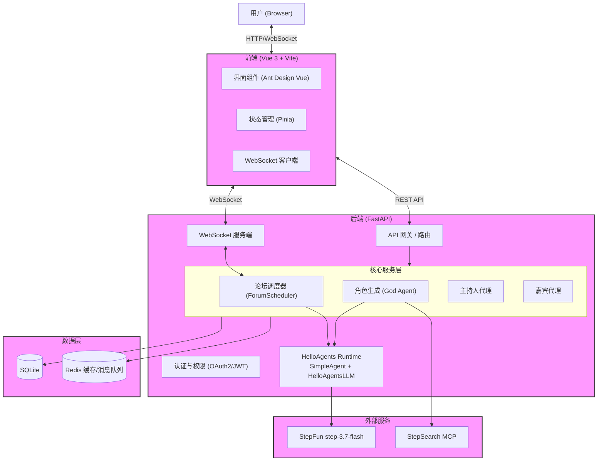

# 🎭 MADF: Multi-Agent Discussion Framework

> **让思想在代码中碰撞，让灵魂在字节间共鸣。**

---

### 🌟 想象一下...

想象一下，你置身于一个跨越时空的圆桌会议室。

左手边，**苏格拉底**正抚须沉思，准备用反诘法拆解看似坚固的真理；右手边，**埃隆·马斯克**正激动地挥舞着双手，描绘着火星殖民的宏伟蓝图；而坐在对面的，或许是**孔子**，正温和地阐述着“仁”的治世之道。

他们不再是冰冷的历史符号，也不是只会机械问答的搜索引擎。在这个框架中，他们拥有了**记忆**，拥有了**性格**，甚至拥有了**偏见**。他们会争论，会妥协，会因为观点的共鸣而激动，也会因为理念的冲突而愤怒。

这不是科幻小说，这是 **MADF (Multi-Agent Discussion Framework)** 为你呈现的数字现实。

我们构建的不仅仅是一个聊天室，而是一个**思想的培养皿**。在这里，你可以：
*   观察不同流派的哲学如何交锋；
*   模拟复杂的社会决策过程；
*   甚至仅仅是享受一场高质量的、充满意外的智力狂欢。

---

### 🎯 项目核心

MADF 是一个基于 [HelloAgents](https://github.com/jjyaoao/helloagents) 的**沉浸式多智能体圆桌讨论应用**。它使用 HelloAgents 创建并驱动主持人、嘉宾和角色生成智能体，在应用层保留圆桌调度、双层记忆与实时 WebSocket 交互。

*   **🧠 深度角色生成 (RealGod Agent)**: 基于 ReAct 框架，智能体能够主动搜索互联网，学习真实人物的生平、理论与性格，拒绝脸谱化的 NPC。
*   **💾 双层记忆系统**: 
    *   **私有记忆**: 智能体拥有内心独白，能记住自己的思考过程，避免“复读机”式的发言。
    *   **共享记忆**: 所有参与者共享讨论上下文，确保对话的连贯性与针对性。
*   **🎤 动态主持机制**: 引入主持人（Moderator）角色，负责控场、总结与推进议题，防止讨论发散或陷入死循环。
*   **📊 多维评估体系**: 独创的 5 维评估指标（观点多样性、深度演进、交互批判性等），量化讨论质量。

---

### 🏗️ 系统架构介绍

MADF 采用 **现代化的前后端分离架构**，后端基于 Python 异步生态构建高性能调度中心，前端采用 Vue 3 打造沉浸式交互体验，通过 WebSocket 实现毫秒级的双向流式通信。

#### 1. 整体架构图



#### 2. 逐层解析

**🖥️ 前端层 (Frontend)**
- **技术栈**: Vue 3 (Composition API), Vite, TypeScript, Pinia, Ant Design Vue。
- **核心职责**:
    - **流式渲染**: 通过 `useForumWebSocket` 钩子实时接收后端 Token 流，实现“打字机”效果。
    - **状态管理**: 利用 Pinia 管理全局的用户会话、论坛列表及当前对话上下文。
    - **路由与权限**: Vue Router 配合导航守卫，实现基于 JWT 的登录拦截与页面跳转。

**⚙️ 后端层 (Backend)**
- **技术栈**: Python 3.10+, HelloAgents 1.0.0, FastAPI, Uvicorn, Pydantic。
- **核心模块**:
    - **API 网关**: 处理 HTTP 请求（如创建论坛、查询历史），集成 CORS 与 JWT 鉴权中间件。
    - **论坛调度器 (ForumScheduler)**: 系统的“心脏”，基于 `asyncio` 维护全局事件循环，管理多个智能体的并发思考、发言队列及时间片轮转。
    - **智能体运行时**: 主持人与嘉宾直接继承 HelloAgents `SimpleAgent`，由 `HelloAgentsLLM`、`run()`、`stream_run()`、`add_message()` 和框架历史管理完成推理、流式输出与上下文恢复。
    - **角色生成智能体**: `RealGodAgent` 使用 HelloAgents `ReActAgent`、`ToolRegistry` 与标准 `Tool` 接口调用 StepSearch MCP，生成前执行点名人物一致性校验。
- **通信协议**:
    - **HTTP (REST)**: 用于元数据管理（User, Forum, Persona）。
    - **WebSocket**: 用于实时传输对话内容、系统日志及控制信号。

**💾 数据层 (Data Layer)**
- **数据库**:
    - **SQLite (默认)**: 采用 `libsql-client`，零配置启动，适合开发与中小规模部署。
    - **PostgreSQL (实验性)**: 代码包含适配层，但当前 schema 初始化与 CI 门禁以 SQLite 为准；生产使用前需自行完成迁移验证。
- **缓存/消息队列**:
    - **Redis (可选)**: 用于存储系统日志缓冲 (System Logs Buffer) 和高频状态同步。

**🏗️ 基础设施 (Infrastructure)**
- **容器化**: 提供标准 `Dockerfile`，支持多阶段构建 (Multi-stage Build)，最小化镜像体积。
- **编排**: `docker-compose.yml` 一键拉起前后端及依赖服务。
- **质量门禁**: 提供 Pytest、Vitest、类型检查、前端生产构建与 Docker 构建命令，便于提交前在本地或外部 CI 中复现验证。

#### 3. 关键非功能特性
- **实时性**: WebSocket 按 token 流式推送论坛消息；实际延迟和并发能力取决于模型服务、网络与部署资源。
- **可用性**: SQLite 写入包含锁冲突重试，模型调用由 HelloAgents 统一设置超时；生产部署仍应配置外部监控和限流。
- **扩展性**: 新角色可直接继承 HelloAgents `SimpleAgent`，复用 MADF 的论坛编排协议或注册新的 HelloAgents Tool。
- **安全**: 生产环境强制开启 JWT 认证；敏感密钥 (API Key) 仅在服务端存储，不暴露给前端。


### 🚀 快速启动

MADF 提供了灵活的启动方式，既支持 **Docker 一键部署**（推荐），也支持 **本地源码开发**。

#### 前置要求
- **操作系统**: Windows 10+ / macOS / Linux
- **依赖环境**:
  - Python 3.10+
  - Node.js 20+ (仅源码开发需要)
  - Docker & Docker Compose (仅容器化部署需要)
- **API 密钥**: 必须持有 StepFun API Key，并开通 Step Plan 模型与 StepSearch MCP 能力。

---

#### 1. 配置环境变量 (所有方式通用)

在项目根目录下复制配置文件并填入密钥：

```bash
# 复制示例配置
cp .env.example .env
```

编辑 `.env` 文件，填入你的 API Key：

```ini
# HelloAgents / StepFun configuration
API_KEY="your_api_key_here"
MODEL_NAME="step-3.7-flash"
BASE_URL=https://api.stepfun.com/step_plan/v1/
```

> **注意**: 
> 1. `BASE_URL` 必须以 `https://` 开头并以 `/` 结尾。
> 2. 角色生成通过 HelloAgents Tool 调用 StepSearch MCP，模型与搜索复用同一个 StepFun Key。

---

#### 2. 方式一：Docker Compose 一键启动 (推荐)

Compose 会从当前工作树构建镜像，确保运行内容与待审阅代码一致。

**一键部署命令**

您可以直接下载我们准备好的 `docker-compose.yml` 文件并启动：

```bash
# 在项目根目录配置 .env 后构建并启动
docker compose up --build -d
```

**配置说明**

请在 `.env` 中配置至少以下变量：

```yaml
API_KEY=your_real_api_key_here
MODEL_NAME=step-3.7-flash
BASE_URL=https://api.stepfun.com/step_plan/v1/
SECRET_KEY=replace-with-a-long-random-secret
```

- **访问地址**: `http://localhost:8000`
- **查看日志**: `docker-compose logs -f`
- **停止服务**: `docker-compose down`

#### 3. 方式二：本地源码启动 (开发模式)

适合需要修改代码的开发者。

**步骤 A: 启动后端 (Python/FastAPI)**

```bash
# 1. 创建并激活虚拟环境
python -m venv .venv
# Windows:
.venv\Scripts\activate
# Mac/Linux:
source .venv/bin/activate

# 2. 安装依赖
pip install -r requirements.txt

# 3. 初始化数据库 (首次运行需要)
# 系统会自动在 data/madf.db 创建表结构

# 4. 启动服务 (开启热重载)
uvicorn app.main:app --reload --host 0.0.0.0 --port 8000
```

后端启动后，创建论坛并启动讨论。主持人开场、至少一位嘉宾思考并发言、主持人总结，即构成一次端到端 HelloAgents 多智能体流程。

可先运行框架迁移相关测试：

```bash
pytest app/tests/test_helloagents_integration.py app/tests/test_agent_logic.py -q
```

也可以不启动数据库和前端，直接运行最小端到端讨论：

```bash
python demo_helloagents.py
```

该示例依次执行主持人开场、嘉宾思考与发言、阶段总结和闭幕，所有模型调用均由 HelloAgents 1.0.0 驱动。

共创项目的标准脚本入口同样可用：

```bash
python main.py
```

仓库还提供 `main.ipynb`，用于按毕业设计模板逐步展示 HelloAgents 原生 Agent、流式讨论和最终转录结果。

**步骤 B: 启动前端 (Vue 3/Vite)**

```bash
cd frontend

# 1. 安装依赖
npm ci

# 2. 启动开发服务器
npm run dev
```

- **前端访问**: `http://localhost:5173`
- **后端 API**: `http://localhost:8000`

> **注意**: 在开发模式下，前端 Vite 服务器会通过代理 (Proxy) 将 API 请求转发到后端 8000 端口，请确保后端已启动。

---

#### 4. 常见问题 (FAQ)

- **Q: 启动后角色生成缓慢？**
  - A: `ReActAgent` 会通过 StepSearch MCP 检索并核实人物资料，首次生成通常需要多轮模型与搜索请求。
- **Q: WebSocket 连接失败？**
  - A: 请确保没有防火墙或代理软件拦截 `ws://localhost:8000` 的连接。

---

## 🧩 HelloAgents 使用边界

由 HelloAgents 1.0.0 提供：

- 主持人和嘉宾的 `SimpleAgent` 生命周期、历史记录、同步推理与流式输出
- 角色生成的 `ReActAgent`、`ToolRegistry`、`Tool` 与 `ToolResponse`
- StepFun 模型适配、上下文压缩兼容和历史消息恢复

由 MADF 应用层提供：

- 发言申请、公平调度、主持流程、论坛时长与中断策略
- 私有思考记录与论坛共享上下文的业务规则
- FastAPI、JWT、数据库、Redis、WebSocket 与 Vue 页面

## 🧭 关键代码导航

维护者可以按下面的顺序快速审阅 HelloAgents 集成与 MADF 应用层边界：

| 关注点 | 关键文件 | 说明 |
| --- | --- | --- |
| HelloAgents 主持人与参与者 | [`app/agent/agent.py`](app/agent/agent.py) | `ModeratorAgent`、`ParticipantAgent` 直接继承 `SimpleAgent`，使用 `run()`、`stream_run()` 与 `add_message()` |
| ReAct 真实角色生成 | [`app/agent/real_god.py`](app/agent/real_god.py) | 使用 `ReActAgent`、`ToolRegistry`、标准 `Tool`，包含真实人物一致性与多角色顺序校验 |
| StepSearch MCP 适配 | [`app/agent/stepsearch.py`](app/agent/stepsearch.py) | 负责 MCP 初始化、`web_search`/`web_fetch` 调用和搜索结果整理 |
| 论坛调度与恢复 | [`app/services/forum_scheduler.py`](app/services/forum_scheduler.py) | 发言公平调度、共享上下文、1800 秒时长计算、中断、停止和容器重启恢复 |
| 论坛业务入口 | [`app/services/forum_service.py`](app/services/forum_service.py) | 权限校验，并在首次启动时写入唯一权威 `start_time` |
| REST 与 WebSocket API | [`app/api/v1/endpoints/forums.py`](app/api/v1/endpoints/forums.py) | 论坛创建、启动、停止、历史、日志、观众插话和 WebSocket 鉴权 |
| 数据持久化 | [`app/crud/__init__.py`](app/crud/__init__.py)、[`app/db/schema.sql`](app/db/schema.sql) | 论坛、参与者、消息、开始时间、时长和恢复状态的 SQLite 持久化 |
| 前端论坛状态 | [`frontend/src/stores/forum.ts`](frontend/src/stores/forum.ts) | REST/WebSocket 状态同步，并接收启动接口返回的权威开始时间 |
| 论坛创建与计时器 | [`frontend/src/views/ForumListView.vue`](frontend/src/views/ForumListView.vue)、[`frontend/src/components/forum/ForumTimer.vue`](frontend/src/components/forum/ForumTimer.vue) | 页面选择角色和 1–120 分钟时长；计时器按 `start_time + duration_minutes` 展示剩余时间 |
| 迁移与恢复测试 | [`app/tests/test_helloagents_integration.py`](app/tests/test_helloagents_integration.py)、[`app/tests/test_forum_recovery.py`](app/tests/test_forum_recovery.py) | 验证原生 Agent API、历史恢复、30 分钟截止边界及重启不重置计时 |

## 📖 使用示例

```python
from app.agent.agent import ModeratorAgent, ParticipantAgent

persona = {
    "name": "林衡",
    "title": "公共政策研究者",
    "system_prompt": "你是林衡，请自然、审慎地参与讨论。",
}

moderator = ModeratorAgent("人工智能如何参与公共决策？")
participant = ParticipantAgent("林衡", persona, 1, moderator.theme)

opening = "".join(moderator.opening([persona]))
thought = participant.think(opening)
speech = "".join(participant.speak(thought, opening))
```

## 📊 验证与评估

```bash
pytest -q
cd frontend
npm ci
npm run type-check
npm run test:unit -- --run
npm run build
```

`exam/` 提供标准评估、基线对比和消融实验脚本；这些评估 Agent 同样通过 HelloAgents `SimpleAgent` 运行。

## 🎯 项目亮点

- HelloAgents 原生主持人、嘉宾与 ReAct 角色研究智能体
- 支持 1 至 120 分钟讨论、观众插话、流式消息和容器重启恢复
- StepSearch MCP 联网核实人物资料，并阻止点名人物被替换为无关原创角色
- 后端、前端和 Docker 三层可复现质量门禁

## 🔮 未来计划

- 将 MADF 私有记忆抽象为可复用的 HelloAgents 上下文组件
- 增加多模型质量与成本对比评估
- 扩展主持人策略和讨论质量可视化

## 🤝 贡献指南

欢迎通过 Issue 和 Pull Request 提交缺陷、测试、文档与讨论策略改进。提交前请运行上面的完整验证命令，并确保敏感 API Key 未进入 Git。

## 👤 作者

- GitHub: [@dongyu23](https://github.com/dongyu23)
- Email: 1410875946@qq.com

## 🙏 致谢

感谢 Datawhale 社区、Hello-Agents 维护者与 StepFun 提供的模型和 StepSearch MCP 能力。

## 📄 许可证

本项目作为 Hello-Agents 共创项目的一部分，遵循 [CC BY-NC-SA 4.0](LICENSE) 许可协议和共创项目规则；完整协议正文见仓库根目录的 [`LICENSE.txt`](../../LICENSE.txt)。
