# 销售数据分析报告

## 一、数据概况

本报告基于一份包含 **800 行 × 13 列** 的订单级销售数据集。数据字段覆盖交易、产品、渠道与体验四大维度，具体包括：订单ID、订单日期、产品类别、产品名称、单价、数量、销售额、折扣率、地区、销售渠道、支付方式、客户满意度、配送天数。

数据时间跨度覆盖 2024 年全年，包含电子产品、家居用品、服装鞋帽、美妆个护、食品饮料五大产品类别，覆盖华东、华北、华南、西南、东北、华中、西北等地区，销售渠道涵盖线上商城、直播带货、线下门店，支付方式包括微信支付、支付宝、银行卡、货到付款。

分析围绕六个任务展开：销售额时间趋势、产品类别结构、地区与渠道对比、折扣率与满意度及配送关联、销售额异常值检测、支付方式与满意度对比。全年总销售额约 **954,243 元**。

---

## 二、核心发现

### 1. 销售额时间趋势：7月大额订单拉高全年，剔除后呈"下半年走强"季节性

将 800 条订单按月汇总后，销售呈现明显的**非均衡分布**：

| 月份 | 销售额(元) | 订单量(单) |
|------|-----------|-----------|
| 1月 | 52,819 | 57 |
| 2月 | 86,614 | 68 |
| 3月 | 54,178 | 60 |
| 4月 | 28,022 | 50 |
| 5月 | 54,042 | 65 |
| 6月 | 24,321 | 66 |
| **7月** | **314,951** | 72 |
| 8月 | 36,498 | 80 |
| 9月 | 89,018 | 74 |
| 10月 | 102,155 | 72 |
| 11月 | 68,625 | 71 |
| 12月 | 43,000 | 66 |

**关键结论：**

- **全年销售高度集中于7月**：7月销售额 314,951 元，占全年总额的约 **33%**，但订单量仅 72 单，属"少数大额订单拉高总额"。下钻发现 2024-07-13 单日销售额即达 272,336.85 元（占全年 28.5%），为应剔除的异常值。
- **剔除异常后呈"下半年走强"季节性**：8–11月销售额（36,498 / 89,018 / 102,155 / 68,625 元）明显高于上半年多数月份，10月为剔除异常后的真实峰值。
- **订单量走势平稳**：月订单量在 50–80 单区间波动，8月最高（80单）、4月最低（50单），说明销售额剧烈波动并非来自订单数量，而是个别大额订单。
- **季节性形态**：呈"年中冲高（7月大单）、年末翘尾（10–11月）"双峰，4月、6月为全年低谷。

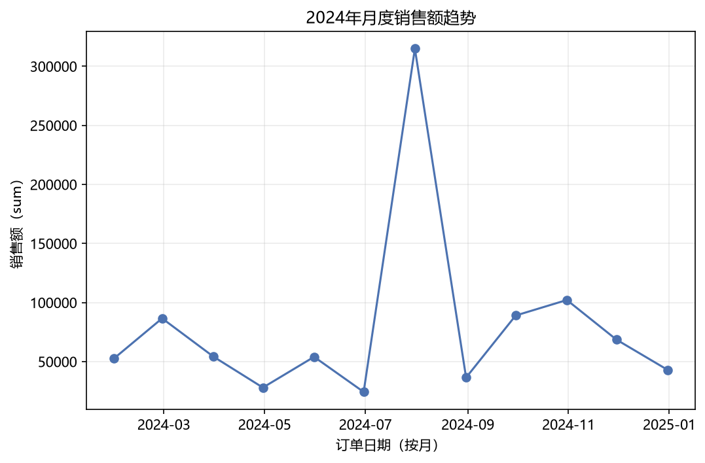
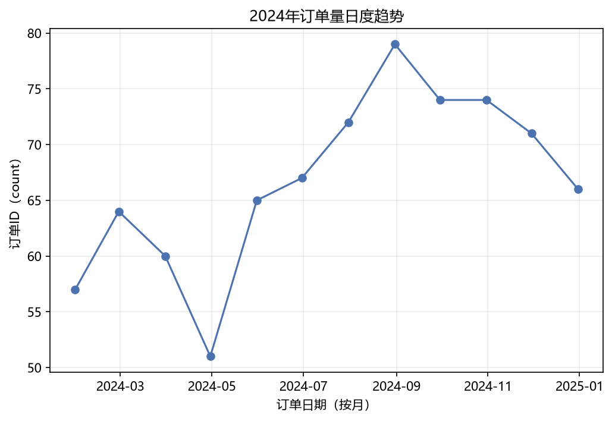

### 2. 产品类别结构：电子产品"一枝独秀"，呈现高价低频模式

- **电子产品是绝对核心品类**：销售额合计 721,612.94 元，占全部销售额的 **75.6%**，远超其他四类。第二名家居用品仅 88,836.64 元（9.3%），服装鞋帽 83,883.39 元（8.8%），美妆个护 36,100.70 元（3.8%），食品饮料 23,920.44 元（2.5%）。
- **订单量与销售额严重背离**：服装鞋帽订单量最多（199单）、家居用品 173 单、食品饮料 169 单，而销售额最高的电子产品订单量仅 130 单（倒数第二），说明电子产品依靠高单价驱动，而非订单数量。
- **客单价差异悬殊**：电子产品平均客单价高达 5,550.87 元，是第二名家居用品（513.51 元）的 **10.8 倍**；服装鞋帽 421.52 元、美妆个护 279.85 元、食品饮料仅 141.54 元。

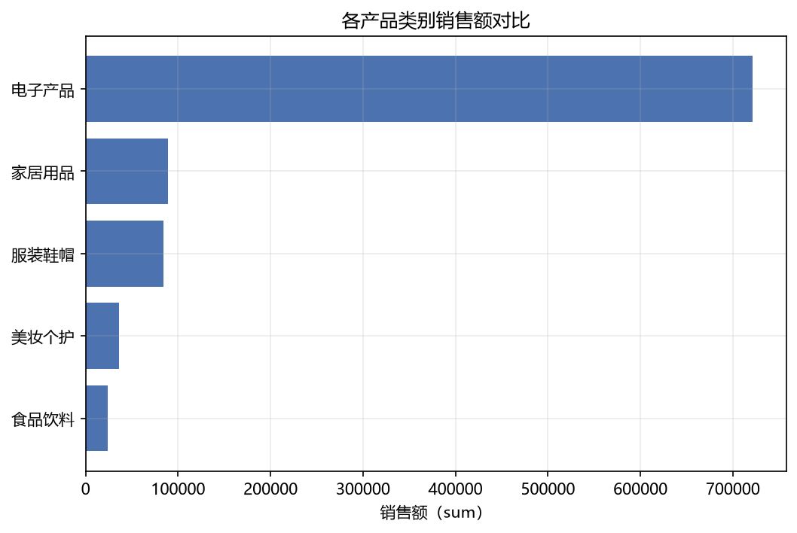
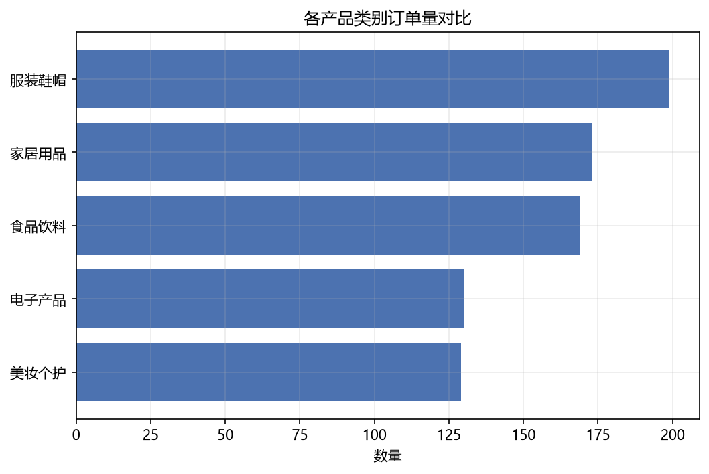

### 3. 地区与渠道：华东"一超多强"，线上商城为绝对主力

- **地区维度呈"一超多强"格局**：华东销售额 556,801.25 元，占全国 **58.3%**，远超华北（127,687.37 元，13.4%）和西南（91,531.25 元，9.6%）；华南 77,231.29 元（8.1%），西北最低仅 4,164.94 元（0.4%）。
- **渠道维度线上化程度极高**：线上商城销售额 656,983.21 元（**68.8%**），直播带货 204,586.32 元（21.4%），线下门店仅 92,784.58 元（9.7%）。
- **地区内部质量差异明显**：华东客单价最高（2,054.62 元），东北次之（1,478.92 元），华南最低（576.35 元）、西北仅 297.5 元。
- **优势组合**："华东 × 线上商城"为最强增长引擎；华南、西北等低贡献地区应优先借力线上渠道突破。

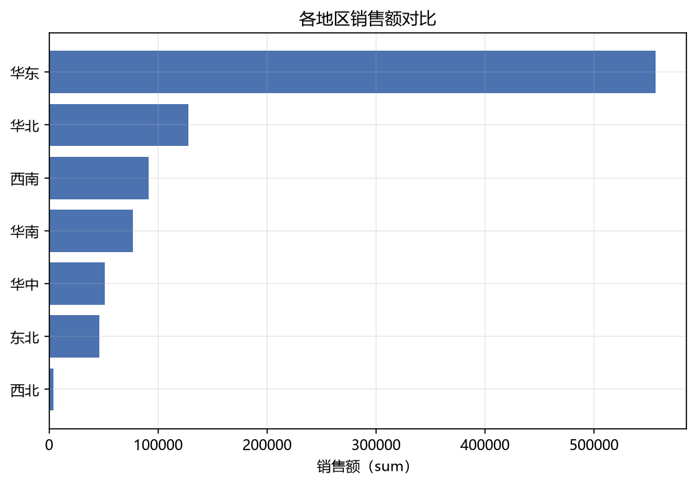
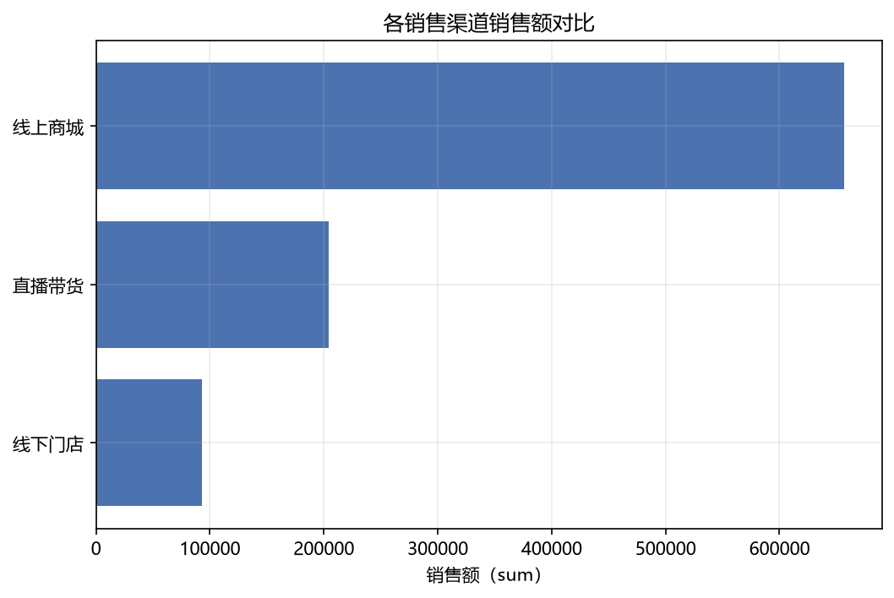

### 4. 折扣与体验关联：配送时效是满意度关键，折扣几乎无效

- **配送天数与满意度呈显著中等负相关（r = -0.593）**，是所有字段对中最强关系。配送天数均值 2.85 天（范围 1~6 天），配送越慢满意度越低，履约时效是满意度主要驱动因素。
- **折扣率与销售额几乎无相关（r = -0.036）**，散点图呈杂乱无趋势分布。折扣率均值仅 6%（最高 20%），0 折扣订单最多（317 笔），当前折扣对销售额拉动非常有限。
- **折扣率与满意度同样微弱负相关（r = -0.103）**，打折并未提升满意度，暗示满意度更多由配送体验决定。
- **销售额主要由单价（r = +0.333）和数量（r = +0.301）驱动**，符合"高价多量带来高销售额"的逻辑，但解释力有限。
- 配送天数与销售额（r = -0.068）、折扣率与配送天数（r = +0.056）均近乎无关，说明配送与折扣是两个独立运营维度。

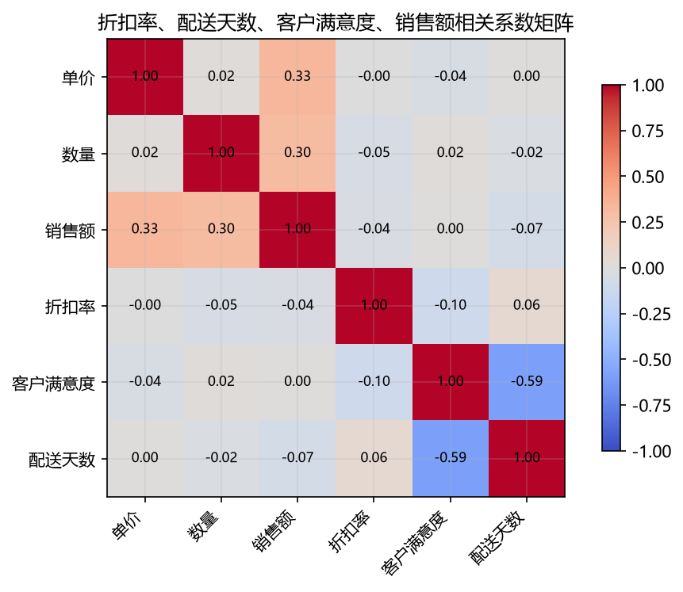
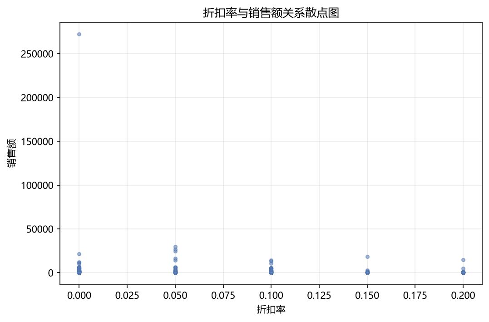
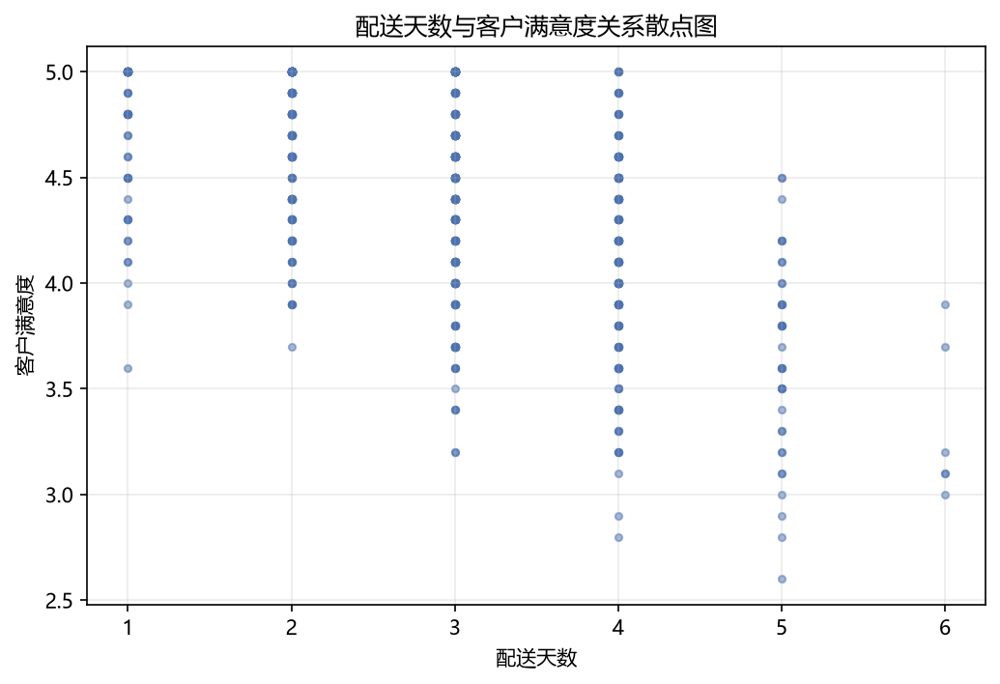

### 5. 销售额异常值：约13%订单为离群，高度集中于电子产品与华东

- **离群规模**：IQR 方法显示销售额正常区间为 [-523.04, 1143.28]（Q1=101.83, Q3=518.41），共检出 **103 个异常订单，占比 12.88%**；数量列正常区间 [-0.50, 3.50]，检出 **96 个异常，占比 12.00%**，两列异常比例接近，说明极端大额订单往往同时伴随异常数量。
- **极端样本**：最大离群订单 ORD202400166（2024-07-13，销售额 **272,198.00**，数量 50），远超第二名 ORD202400719（29,541.96）近 9 倍；数量列最大异常为 ORD202400729（数量 **200**，为正常上限的 57 倍），属明显录入或团购批量订单。
- **分布特征**：销售额均值 1192.94 远高于中位数 226.96，标准差高达 9916.53，最大值 272,198 是中位数的 1200 倍，偏度达 25.72，呈严重右偏。
- **离群分布**：异常高度集中于**电子产品**（最大 272,198，其他类别最高仅 3,712）、**线上商城**渠道、**华东**地区。

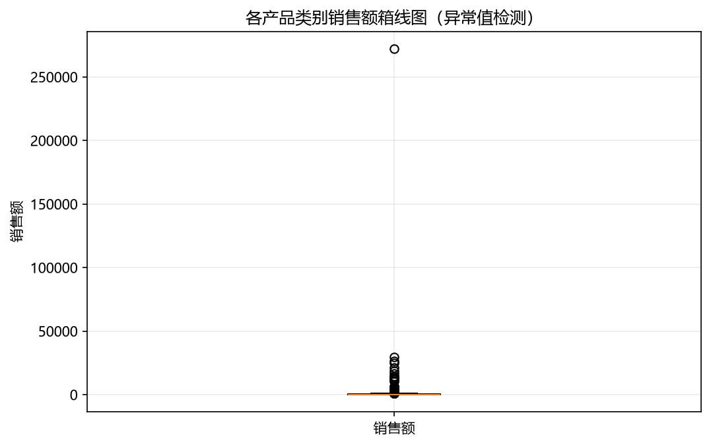
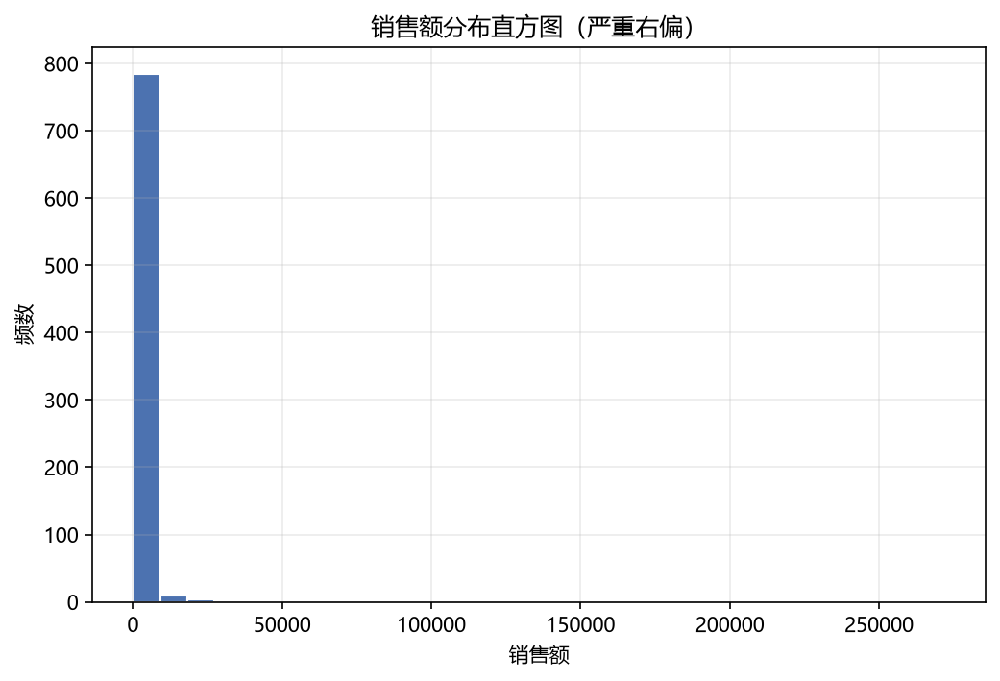

### 6. 支付方式与满意度：差异极小，非关键影响因素

- **满意度差异极小**：银行卡与支付宝并列最高（均 4.48），微信支付 4.47，货到付款最低（4.41），极差仅 **0.07 分**。
- **配送天数呈相反趋势**：微信支付与支付宝并列最长（均 2.88 天），满意度最低的货到付款配送反而最快（2.76 天），银行卡最快（2.69 天）。
- **样本高度集中**：微信支付 370 单、支付宝 274 单，而货到付款与银行卡各仅 78 单，小样本可能放大后两者波动。
- **结论**：不同支付方式的服务体验高度趋同，满意度差异（<0.1 分）与配送差异（<0.2 天）均不显著，支付方式并非影响满意度的关键因素。

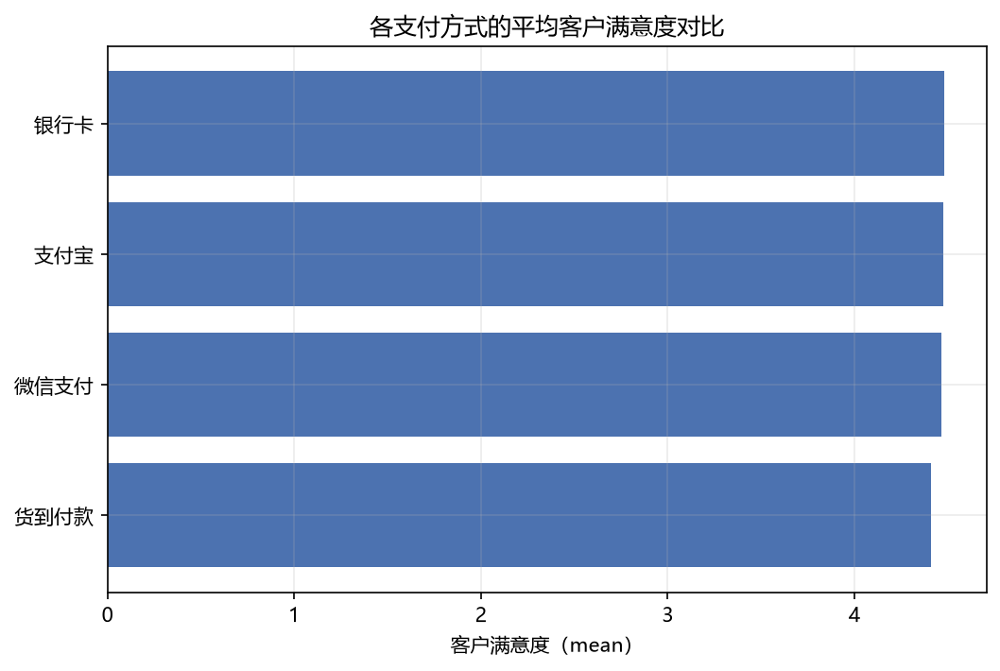

---

## 三、业务建议

1. **建立大额订单监控与归因机制**：全年约 13% 订单为离群值，且 7月单笔 27 万元订单直接扭曲月度趋势（占比 28.5%）。建议对 ORD202400166、ORD202400729 等极端订单单独核验（核查是否为批发/团购或录入错误），并在日常报表中采用**中位数或对数变换**呈现销售额，避免异常值误导决策。

2. **优先优化配送时效以提升满意度**：配送天数与满意度相关性最强（r = -0.593），而折扣对满意度和销售额均几乎无正向作用。建议将资源从"折扣促销"转向"履约提速"，重点压缩配送天数（当前均值 2.85 天，目标向 2 天以内靠拢），尤其针对配送较慢的微信支付与支付宝订单。

3. **巩固"华东 × 线上商城"核心基本盘，同时破解单一依赖**：华东贡献 58.3% 销售额、线上商城贡献 68.8%，两者叠加是最强引擎，应优先保障库存与履约资源。但电子产品单品类占比高达 75.6%，存在结构性风险，需防范品类波动对整体业绩的冲击。

4. **对"高频低客单"品类实施客单价提升策略**：家居用品、服装鞋帽、食品饮料订单量高但客单价低（141–513 元），建议通过组合销售、满减凑单、关联推荐等方式提升客单价，平衡对电子产品的过度依赖。

5. **针对低贡献地区精准投放**：华南（客单价仅 576.35 元）、西北（297.5 元）等地区贡献低且客单价低，应优先借力线上商城/直播带货的高效渠道（而非占比仅 9.7% 的线下门店）实现突破，并针对华南等高订单量地区优化客单价策略。

---

## 四、分析方法说明

- **工具与流程**：基于 Python 数据分析栈（pandas 进行数据清洗与分组聚合，matplotlib/seaborn 完成可视化），按六个分析任务分别产出结论与图表。
- **时间趋势分析**：将订单日期解析为月份后进行月度汇总（销售额、订单量），并对异常月份进行单日下钻定位。
- **结构对比分析**：按产品类别、地区、销售渠道、支付方式进行分组聚合，比较销售额、订单量与客单价（平均销售额）。
- **相关性分析**：采用 Pearson 相关系数矩阵（热力图）量化折扣率、配送天数、单价、数量、销售额、满意度之间的线性关系，并结合散点图判断趋势形态。
- **异常值检测**：采用 IQR（四分位距）方法，以 [Q1-1.5×IQR, Q3+1.5×IQR] 为正常区间识别销售额与数量的离群订单，并统计其类别、渠道、地区分布；结合均值、中位数、标准差、偏度刻画分布形态。
- **分组对比**：对支付方式分组的满意度与配送天数进行均值对比，评估组间差异显著性（极差）。

> 说明：本报告所有结论与数字均来自输入的分析结论，未作额外推断或编造。